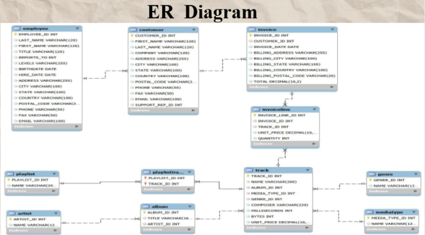

# 🎵 Music Store Data Analysis using SQL

---

## 📌 Project Overview
This project analyzes a **music store database** using SQL to extract meaningful business insights.

It focuses on:
- 👥 Customer behavior  
- 💰 Sales performance  
- 🎧 Genre & artist trends  

---

## 🧠 Problem Statement
The music store generates large volumes of data but lacks structured analysis.

This leads to difficulty in:
- Identifying top customers  
- Tracking revenue trends  
- Understanding popular genres  

👉 This project solves these problems using SQL queries.

---

## 🛠️ Tools & Technologies
- SQL (MySQL / PostgreSQL)
- Relational Database
- DB Browser / pgAdmin

---

## 🗂️ Database Schema

  

